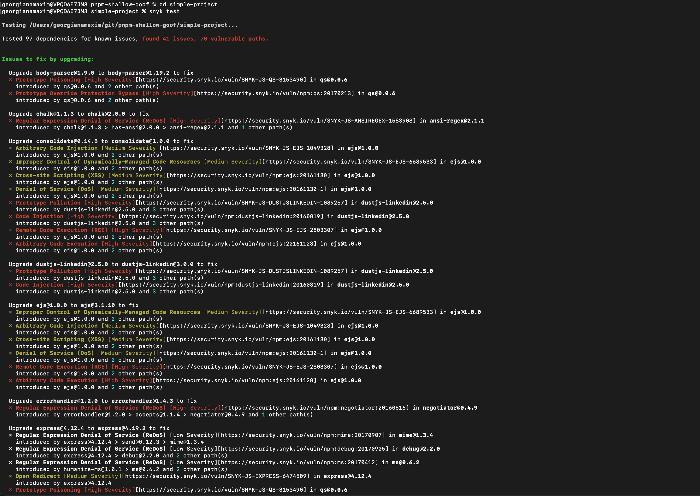
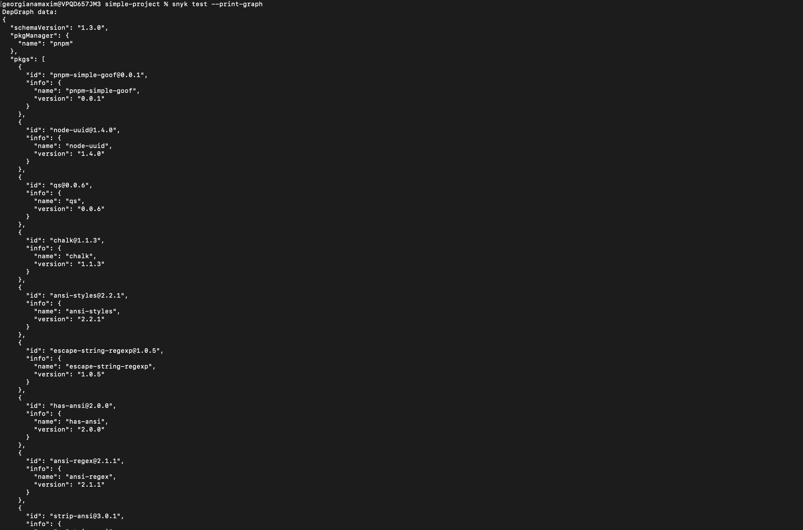
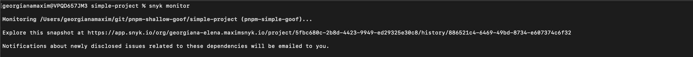
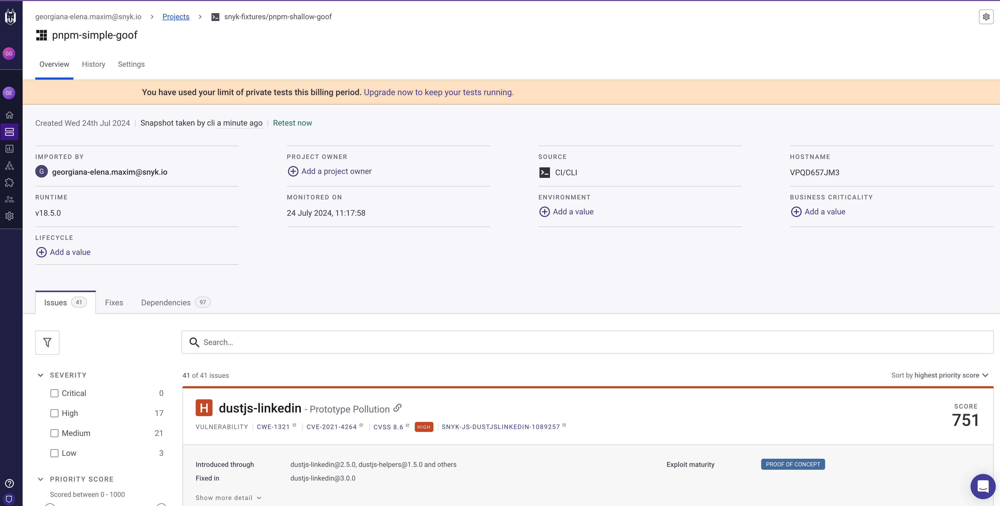
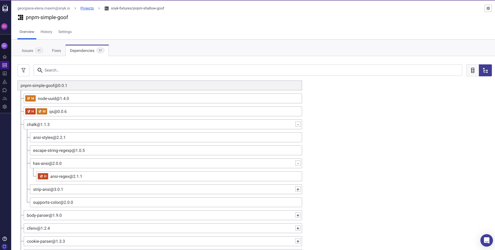

# simple-project

This is a pnpm project with no code, but with manifest files that have vulnerable dependencies.
The goal of this repo is to showcase the pnpm test and monitor functionalities in the cli.

Run `snyk test` or `snyk monitor`.
To include dev depenendcies, use the `--dev` option.
To see the returned dependency graph, use the `--print-graph` option.

### snyk test

`snyk test` ouput

.png>)

### snyk test --print-graph

`snyk test --print-graph` ouput

.png>)

### snyk monitor

`snyk monitor` cli ouput

Monitored project in UI

