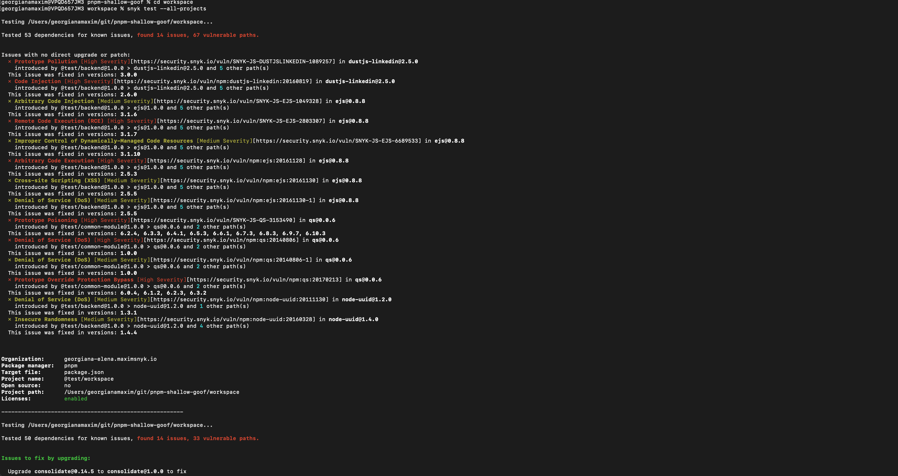
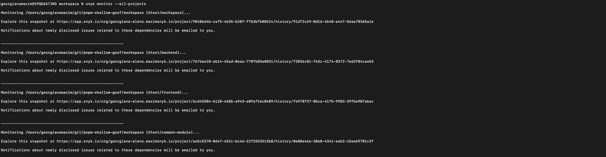
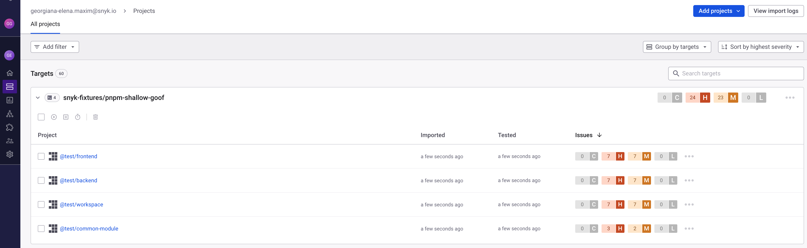
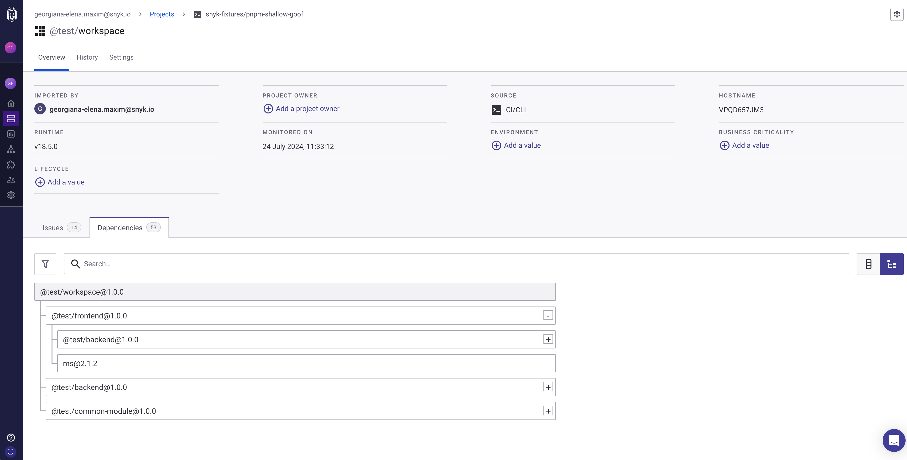

# workspace

This is a pnpm workspace with zero code and vulnerable dependencies. It includes cross referenced packages.
The goal of this repo is to showcase the pnpm test and monitor functionalities in the cli for pnpm workspaces.

Run `snyk test --all-projects` or `snyk monitor --all-projects`.
To see the returned dependency graph, use the `--print-graph` option.
To include dev dependencies, use the `--dev` option.
For workspaces, the `--all-projects` flag needs to be used.

### snyk test

`snyk test` output

.png>)

### snyk monitor

`snyk monitor` cli output

Monitored project in UI

